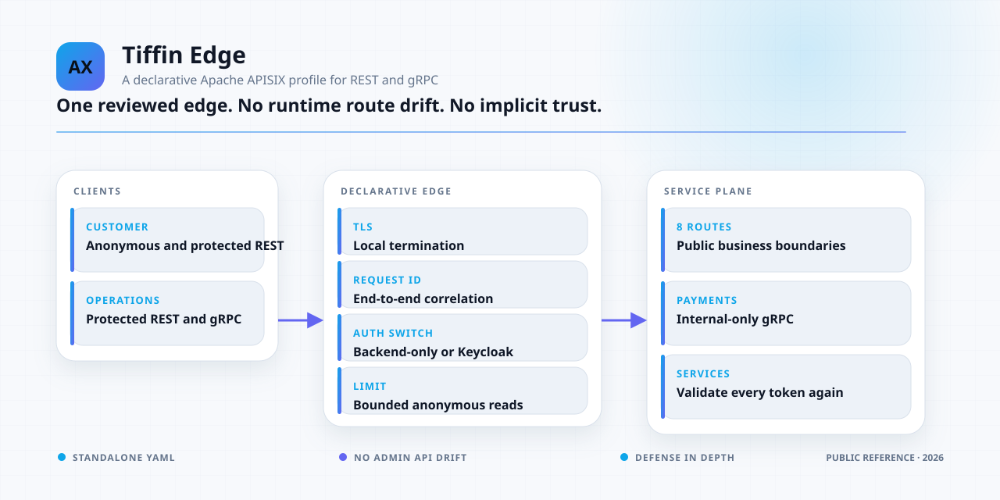
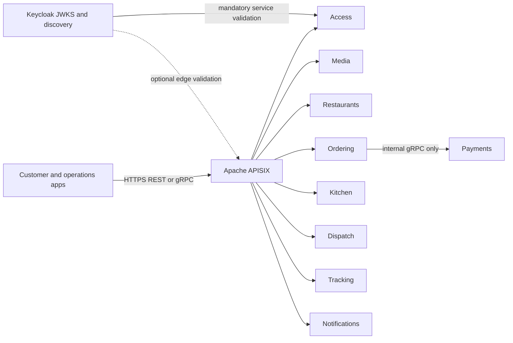

<div align="center">

# Tiffin APISIX

**A declarative Apache APISIX edge profile for the Tiffin food-delivery platform.**

TLS termination, REST and gRPC routing, request identity, anonymous catalog throttling,
and optional Keycloak token validation—with no runtime route drift.

[](https://github.com/panahister/tiffin-apisix/actions/workflows/ci.yml)
[](LICENSE)
[](product/tiffin-local/config.yaml)
[](#project-status)

[Architecture](docs/ARCHITECTURE.md) ·
[Security model](docs/SECURITY-MODEL.md) ·
[Route source](product/tiffin-local/apisix.template.yaml) ·
[Tiffin backend](https://github.com/panahister/mpcore-tiffin-sample) ·
[MP ecosystem](https://github.com/panahister/mpcore/blob/main/docs/architecture/ecosystem.md)

</div>

<picture>
  <source media="(prefers-color-scheme: dark)" srcset="docs/images/ecosystem-dark.svg">
  <source media="(prefers-color-scheme: light)" srcset="docs/images/ecosystem-light.svg">
  
</picture>

This repository owns the Tiffin-specific gateway source consumed by the MP Core food-delivery reference.
It is an integration overlay for the official `apache/apisix:3.18.0-debian` image, not a fork of Apache
APISIX. The route model remains small, reviewable, and generated only from tracked inputs plus local TLS
material.

## Gateway responsibilities

| Responsibility | Tiffin policy |
|---|---|
| Public entry point | One TLS edge for browser REST and selected unary gRPC methods |
| Route ownership | Declarative YAML in Git; standalone mode, no etcd or Admin API |
| Request correlation | Create or preserve `X-Request-Id` and return it to the caller |
| Anonymous traffic | Permit restaurant/menu GETs with a local per-address rate limit |
| Protected traffic | Route with a shared authentication profile and forward the bearer token |
| Edge authentication | Switchable: backend-only validation or an additional Keycloak/JWKS check |
| Service authorization | Always performed again by the owning backend |
| Internal services | Payments has no edge route; service-to-service calls remain internal |

## Architecture at a glance



The dotted validation boundary is defense in depth. Turning it off does not turn protected backend APIs
into anonymous APIs because every service validates identity, audience, role, and tenant itself.

## Repository map

```text
product/tiffin-local/config.yaml          APISIX standalone data-plane configuration
product/tiffin-local/apisix.template.yaml tracked upstreams, plugins, routes, and TLS placeholders
product/tiffin-local/edge-auth.off.yaml   backend-validation-only edge profile
product/tiffin-local/edge-auth.keycloak.yaml
                                           additional OIDC/JWKS edge validation
scripts/render.py                          deterministic local renderer
tests/                                     route, security, render, and public-boundary checks
```

## Validate and render

Repository tests use only the Python standard library:

```bash
python3 -m unittest discover -s tests -v
```

Render a local APISIX data file from a certificate, private key, and one authentication profile:

```bash
python3 scripts/render.py \
  --auth off \
  --certificate /path/to/localhost.crt \
  --private-key /path/to/localhost.key \
  --output /path/to/generated/apisix.yaml
```

Use `--auth keycloak` to add edge JWT validation. The output contains the local private key and is created
with owner-only permissions; never commit it.

The integrated Tiffin backend creates a local certificate, renders this profile, mounts the result into
the official APISIX image, and runs readiness plus business scenarios. See
[mpcore-tiffin-sample](https://github.com/panahister/mpcore-tiffin-sample).

## Routes

| Public path | Protocol | Access |
|---|---|---|
| `/v1/restaurants*` GET | REST | Anonymous with rate limit |
| `/v1/access/*` | REST | Authenticated |
| `/v1/media/*` | REST | Authenticated |
| `/v1/restaurants*` non-GET | REST | Authenticated |
| `/v1/orders*` | REST | Authenticated |
| `/v1/kitchen/*` | REST | Authenticated |
| `/v1/tracking/*` | REST | Authenticated |
| `/v1/notifications/*` | REST | Authenticated |
| `/tiffin.ordering.v1.*` | gRPC | Authenticated |
| `/tiffin.dispatch.v1.*` | gRPC | Authenticated |

No route exposes the Payments service.

## Project status

This is a public reference proof of concept. Both edge-auth profiles and the complete backend scenarios
have been run locally. The profile uses one APISIX data plane and a local rate-limit policy. Production
certificate automation, external secret custody, distributed rate limits, WAF/bot policy, multi-node
APISIX, access-log redaction, load acceptance, and operational SLOs remain deployment-specific gates.

## Contributing and security

Read [CONTRIBUTING.md](CONTRIBUTING.md). Report vulnerabilities privately through
[SECURITY.md](SECURITY.md). Participation is governed by [CODE_OF_CONDUCT.md](CODE_OF_CONDUCT.md).

## License

Licensed under [Apache License 2.0](LICENSE). Apache APISIX and Keycloak names and marks belong to their
respective owners and are used only to identify the integrated technologies.
