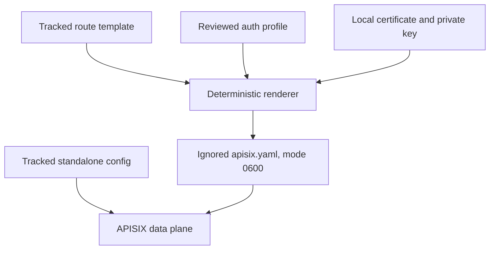

# Architecture

Tiffin uses Apache APISIX as a declarative edge, not as the platform's policy decision point. The edge
terminates local TLS, routes REST and gRPC, assigns request identity, and limits anonymous catalog traffic.
Authentication at the edge is optional defense in depth; backend validation is mandatory.

## Standalone data plane

`config.yaml` selects APISIX `data_plane` with the YAML configuration provider. There is no etcd and no
Admin API, so a runtime request cannot create a route that differs from the reviewed source. Updating the
gateway means reviewing the template, rendering a new data file, validating it, and replacing the data-
plane instance.



Only local TLS material enters the generated file. The rendered file is secret-bearing output and never
belongs in Git.

## Routing model

Each backend owns a stable upstream. Public REST paths use `/v1/...`; selected unary gRPC methods use the
standard `/<package>.<Service>/<Method>` path form. Payments is intentionally absent because only trusted
services call it.

The anonymous restaurant route has higher priority than the protected restaurant route and accepts GET
only. All other restaurant methods therefore fall through to the authenticated profile.

## Identity and authorization

```mermaid
sequenceDiagram
  participant C as Client
  participant A as APISIX
  participant K as Keycloak JWKS
  participant S as Domain service

  C->>A: Request with bearer token
  opt EDGE_AUTH=keycloak
    A->>K: Discover keys; verify token locally via JWKS
  end
  A->>S: Forward original Authorization header
  S->>S: Validate issuer, signature, audience, role, tenant, and domain policy
  S-->>A: Response
  A-->>C: Response with X-Request-Id
```

APISIX does not add trusted identity headers. The backend receives the original bearer token and derives
authority itself. A gateway check can reject an invalid token earlier but cannot grant access.

## Configuration variants

`edge-auth.off.yaml` inserts a no-op rewrite function so route structure stays identical while edge token
validation is disabled. `edge-auth.keycloak.yaml` uses OIDC discovery and JWKS verification in bearer-only
mode, disables user-info and identity header injection, and preserves the access-token header.

The `tiffin-edge` client secret in the public profile is explicitly a local `lab-only-*` value mirrored by
the public realm import. Production integration must source a rotated secret from managed custody or use a
secretless verification pattern supported by the selected APISIX plugin/configuration.

## Deployment limits

The local profile has one data plane and uses APISIX's local rate-limit policy. It does not establish
distributed quotas, active-active configuration rollout, certificate automation, WAF policy, DDoS
protection, or production observability. Those are explicit deployment decisions, not hidden defaults.
